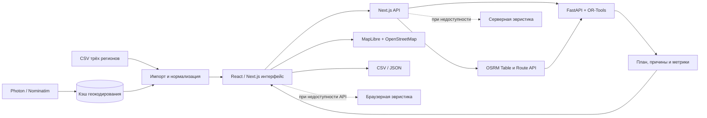

# FieldFlow

Веб-сервис интеллектуального планирования выездных работ для кейса «Билайн Бизнес» хакатона «Лидеры цифровой трансформации».

## Что реализовано

- интерактивная карта MapLibre с заявками, инженерами, дорожными маршрутами OSRM, выбором одного или всех маршрутов и слоем «baseline / VRPTW»;
- серверный FastAPI + OR-Tools solver для VRPTW с жёсткими ограничениями по территории, навыкам, оборудованию, транспорту, смене и окнам SLA;
- лексикографическая цель solver: максимум выполненных заявок → минимум активных инженеров → минимум дорожного пробега;
- официальный детерминированный baseline ТЗ: заявки обрабатываются во входном порядке, назначаются первому допустимому инженеру и добавляются только в конец его маршрута без перестройки;
- строго сопоставимый пробег: процент считается только на пересечении заявок, выполненных обоими планами, по одной и той же дорожной матрице; полное покрытие показывается отдельно;
- импорт 205 заявок и ресурсов из CSV трёх регионов, кэш геокодирования и явная индикация качества координат;
- создание срочной заявки из формы и полный повторный расчёт серверным solver;
- аналитика покрытия, SLA, загрузки, активного флота и пробега;
- экспорт результата в безопасный для Excel UTF-8 CSV и структурированный JSON;
- загрузка произвольного CSV/JSON из интерфейса, включая геокодирование строк без координат;
- диспетчерские сценарии «инженер недоступен» и «заявка отменена» с обязательным перерасчётом;
- журнал перепланирования с переназначениями, изменением порядка заявок, дельтой пробега маршрутов и изменением активного штата;
- объяснение назначения с проверкой навыка, оборудования, транспорта, смены и SLA, влиянием на пробег и сравнением ближайших альтернатив;
- серверная эвристика и браузерная эвристика как контролируемые резервные режимы — активный движок показывается в интерфейсе.

## Данные и принятые допущения

CSV используют Windows-1251 и разделитель `;`. В наборах: Восток — 66, Юго-восток — 83, Югоцентр — 56 заявок. Строка адреса офиса после данных обрабатывается как стартовая точка, а контрольные распределения — как источник пула инженеров.

В исходных данных нет нормативов длительности, транспорта и отдельных справочников навыков/оборудования. Для прототипа типы работ нормализуются в три навыка ТЗ: «Локальные работы», «Подключение и модернизация», «Аварийно-восстановительные работы». Нормативы составляют 30/45/60 минут в зависимости от класса работ; инженерам детерминированно назначаются автомобиль, общественный транспорт, велосипед или пеший режим. Среднее окно SLA настраивается отдельно и не заменяет длительность работы.

Адреса геокодируются бесплатными Photon/Nominatim. Рабочий кэш `data/geocode-cache.json` содержит 198/198 проверенных уникальных адресов: 192 на уровне дома и 6 на уровне улицы, без координат регионального центра. Аудит и объединение старого кэша: `node scripts/complete-geocode-cache.mjs`; импорт CSV: `node scripts/import-csv.mjs`.

В текущем кэше подтверждены 174 из 198 уникальных адресов; 24 точки помечены как резервные. Поэтому пробег и строго сопоставимый набор показываются, но процент изменения намеренно скрыт до тех пор, пока все координаты не будут верифицированы.

## Архитектура



Frontend отвечает за настройку сценария, карту, фильтры, объяснения и аналитику. Next.js API скрывает внешние провайдеры и передаёт нормализованную задачу серверу оптимизации. FastAPI проверяет контракт, а OR-Tools строит VRPTW-план. Маршрутная матрица и геометрия дорог запрашиваются у бесплатного публичного OSRM; карта использует MapLibre и тайлы OpenStreetMap.

## Последовательность расчёта

1. Импортёр читает CSV в Windows-1251, определяет регион, отделяет адрес офиса и нормализует заявки и инженеров.
2. Уникальные адреса разрешаются через кэш Photon/Nominatim. Для неразрешённых адресов применяется явно помеченная резервная координата региона.
3. Интерфейс формирует сценарий: количество заявок и инженеров, SLA-окна, скорость и добавленные срочные заявки.
4. OSRM Table API строит единую асимметричную матрицу дорожных расстояний и времени. Недоступные элементы заменяются приближением и помечают расчёт как оценочный.
5. Для каждой пары «заявка — инженер» проверяются территория, навык, оборудование и транспорт.
6. OR-Tools строит допустимые маршруты с учётом смен, времени движения, ожидания, длительности работ и окон SLA.
7. Независимо рассчитывается официальный baseline ТЗ на том же наборе данных и той же матрице: входной порядок заявок, первый допустимый инженер, добавление только в конец маршрута.
8. Сервер возвращает порядок работ, времена прибытия/начала/окончания, причины неназначения и метрики.
9. UI получает дорожную геометрию маршрутов, рисует результат на карте и пересчитывает аналитику и сравнение.
10. При срочной заявке координата геокодируется, заявка добавляется с повышенным приоритетом и весь план рассчитывается повторно.

## Целевая функция

Solver использует целочисленные веса, размеры которых вычисляются из конкретной задачи. Это обеспечивает строгий лексикографический порядок, а не приблизительный подбор коэффициентов:

1. максимизировать количество выполненных заявок;
2. при одинаковом покрытии максимизировать суммарный приоритет выполненных заявок;
3. при равных первых двух показателях минимизировать число задействованных инженеров;
4. затем минимизировать общий дорожный пробег.

Эквивалентная минимизируемая запись:

```text
F = Wdrop × число_неназначенных
  + Wpriority × сумма_приоритетов_неназначенных
  + Wvehicle × число_активных_инженеров
  + общий_пробег_в_метрах
```

Вес каждого более важного уровня строго больше максимально возможной суммы всех нижестоящих уровней. Поэтому сокращение пробега никогда не может оправдать потерю допустимой заявки или увеличение необходимого штата.

## Ограничения модели

| Ограничение | Тип | Реализация |
|---|---|---|
| Регион обслуживания | Жёсткое | Инженер получает заявки только своей зоны |
| Навык | Жёсткое | Вид работы должен входить в навыки инженера |
| Оборудование | Жёсткое | Требуемый ресурс должен быть у инженера |
| Транспорт | Жёсткое | Инженер должен входить в допустимый для заявки набор транспорта; для аварий набор ужесточается, основной тип показывается как предпочтительный |
| Смена инженера | Жёсткое | Возвращение после последней работы не выходит за окончание смены |
| Окно SLA | Жёсткое | Начало работы находится внутри окна заявки |
| Время обслуживания | Жёсткое | Занимает заданный норматив и влияет на все последующие точки |
| Дорожное время | Жёсткое | Берётся из одной матрицы OSRM для baseline и VRPTW |
| Максимум выполненных заявок | Цель 1 | Главный уровень целевой функции |
| Приоритет заявок | Цель 2 | При равном покрытии сохраняются более приоритетные заявки |
| Количество инженеров | Цель 3 | Минимизируется число непустых маршрутов |
| Общий пробег | Цель 4 | Минимизируется после выполнения целей 1–3 |
| Ожидание и запас окна | Мягкое, эвристики | Используются резервными алгоритмами для выбора устойчивой вставки |

## Известные ограничения прототипа

- 24 из 198 уникальных адресов имеют резервные координаты; до их ручной проверки пробег считается оценочным и процент экономии скрыт.
- Публичные бесплатные OSRM, Photon, Nominatim и OSM tiles имеют ограничения нагрузки и не дают производственного SLA.
- В исходных CSV нет нормативов, транспорта и отдельных справочников ресурсов; используются документированные демонстрационные значения.
- Один инженер моделируется как один маршрут одной смены; перерывы, несколько складов, пополнение оборудования и многодневное планирование не поддерживаются.
- Реализовано добавление срочной заявки. Отмена заявки и внезапная недоступность инженера пока не вынесены в отдельные пользовательские сценарии.
- Результаты сценариев не сохраняются в PostgreSQL и исчезают после перезагрузки страницы.
- Серверный solver ограничен временем расчёта; при недоступности OR-Tools расчёт блокируется с HTTP 503 — скрытого эвристического fallback нет.
- Baseline намеренно прост: он строго следует конкурсному правилу «первый допустимый инженер, добавление в конец» и не пытается улучшать уже созданные маршруты.
- Геометрия дороги используется для визуализации, а ограничения solver рассчитываются по матрице OSRM; при частичном отказе матрицы применяется приближённая скорость.

## Сценарий демонстрации на 3–5 минут

1. **0:00–0:30 — постановка задачи.** Показать 205 заявок трёх регионов, пул инженеров и обязательные ограничения.
2. **0:30–1:20 — построение плана.** Нажать «Построить маршруты», обратить внимание на активный движок OR-Tools, покрытие, число инженеров и статус OSRM.
3. **1:20–2:00 — карта и объяснимость.** Выбрать инженера, показать только его дорожный маршрут, положение во времени и карточку одной заявки с причиной назначения.
4. **2:00–2:35 — поиск и операционная работа.** Во вкладке «Заявки» найти заявку по первой цифре номера или части адреса; во вкладке «Инженеры» найти сотрудника по имени или номеру назначенной заявки, затем открыть навыки и ресурсы.
5. **2:35–3:25 — динамическое перепланирование.** Создать срочную заявку с адресом и окном, запустить перерасчёт и показать обновившиеся назначения и маршруты.
6. **3:25–4:20 — доказательство эффективности.** Открыть «Аналитику», сравнить покрытие, активных инженеров и пробег baseline/VRPTW. Отдельно проговорить, почему процент пробега скрыт при неполном геокодировании.
7. **4:20–5:00 — результат и воспроизводимость.** Экспортировать CSV/JSON, показать качество геокодирования 198/198 и `/api/solver` health-check, затем кратко назвать ограничения бесплатных сервисов.

## Локальный запуск

Требуются Node.js 22.13+ и Python 3.12+.

```powershell
npm ci
python -m venv .venv
.venv\Scripts\python -m pip install -r solver_service\requirements.txt
.venv\Scripts\python -m uvicorn solver_service.app:app --host 127.0.0.1 --port 8000
```

Во втором терминале:

```powershell
$env:SOLVER_URL="http://127.0.0.1:8000"
npm run dev
```

Если `SOLVER_URL` не задан или сервис временно недоступен, `/api/solver` использует серверную эвристику. Если недоступен и API приложения, браузер включает локальный резерв и показывает это пользователю.

## Проверки

```powershell
npm test
npm run typecheck
npm run lint
.venv\Scripts\python -m pytest solver_service -q
npm run build
```

Тесты покрывают baseline, строгое сравнение, ограничения маршрутов, матрицу дорог, серверный контракт, максимизацию покрытия, использование свободного квалифицированного инженера, минимизацию активного флота, отмену заявки, допустимые типы транспорта, аудит геокодирования, справочники навыков/нормативов и CSV/JSON-экспорт.
