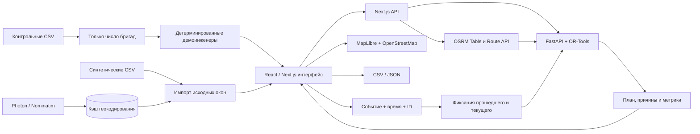

# FieldFlow

Веб-сервис интеллектуального планирования выездных работ для кейса «Билайн Бизнес» хакатона «Лидеры цифровой трансформации».

## Что реализовано

- интерактивная карта MapLibre с заявками, инженерами, дорожными маршрутами OSRM, выбором одного или всех маршрутов и слоем «baseline / VRPTW»;
- серверный FastAPI + OR-Tools solver для VRPTW с жёсткими ограничениями по территории, навыкам, оборудованию, транспорту, смене и окнам SLA;
- лексикографическая цель solver: сначала аварии и срочные заявки, затем общее покрытие, класс работ, число активных инженеров и пробег;
- официальный детерминированный baseline ТЗ: заявки обрабатываются во входном порядке, назначаются первому допустимому инженеру и добавляются только в конец его маршрута без перестройки;
- строго сопоставимый пробег: процент считается только на пересечении заявок, выполненных обоими планами, по одной и той же дорожной матрице; полное покрытие показывается отдельно;
- импорт 205 заявок из синтетических CSV трёх регионов без подмены их исходных окон; контрольные CSV используются только для числа бригад;
- отдельный эксперимент с изменёнными окнами и самостоятельным сравнением его результатов с исходным сценарием;
- событийное перепланирование с фиксированием прошедших и начатых работ; новая обычная заявка сначала вставляется без сдвига согласованных работ;
- аналитика покрытия, SLA, загрузки, активного флота и пробега;
- экспорт результата в безопасный для Excel UTF-8 CSV и структурированный JSON;
- загрузка произвольного CSV/JSON из интерфейса, включая геокодирование строк без координат;
- отдельный генератор заявок: изменение объёма, окон и скорости, применение набора к плану, скачивание совместимых CSV/JSON с заявками и инженерами;
- диспетчерские сценарии «инженер недоступен» и «заявка отменена» с обязательным перерасчётом;
- журнал перепланирования с переназначениями, изменением порядка заявок, дельтой пробега маршрутов и изменением активного штата;
- объяснение назначения с проверкой навыка, оборудования, транспорта, смены и SLA, влиянием на пробег и сравнением ближайших альтернатив;
- при недоступности обязательного OR-Tools расчёт блокируется; скрытого эвристического fallback нет;
- вкладка «Демонстрация»: пошаговый greedy + 2-opt на плоскости, плюс таблицы связей и ног маршрута в аналитике;
- отдельный генератор наборов в `generator/`: синтез заявок и инженеров по OSM-зданиям Москвы, выгрузка CSV/JSON, которые импортируются во вкладке «Заявки».
- вкладка «Редактор данных»: табличное изменение входных параметров заявок и инженеров, проверка значений, геокодирование изменённых адресов и повторный расчёт OR-Tools;
- выбор заявки показывает только входящий к ней участок маршрута от базы или предыдущей остановки; инженер показывает весь свой маршрут;
- стадия выполнения заявки меняется по времени плана: «Не начата» → «Начата» при прибытии → «Завершена» после окончания; транспорт и индивидуальная скорость инженера влияют на ограничения времени и анимацию;
- фильтры и поисковые запросы вкладок сохраняются в пределах браузерной сессии.

## Данные и принятые допущения

CSV используют Windows-1251 и разделитель `;`. В наборах: Восток — 66, Юго-восток — 83, Югоцентр — 56 заявок. Начало/Окончание читаются буквально, включая однозначный час (`0:01`). Первый расчёт не меняет ни одного окна. Адрес офиса после данных служит стартовой точкой.

Синтетические заявки и контрольное распределение — **независимые наборы**. Импорт не читает бригаду или статус из контрольной строки с тем же индексом. Контроль даёт только число уникальных бригад региона: 12/12/11. Создаются демонстрационные `east-demo-01` и т. д.; имена — «Инженер <регион> <номер>», старт — подтверждённый адрес офиса региона, смена 08:00–22:00, транспорт циклом автомобиль → общественный → велосипед → пешком, навыки по фиксированному семиэлементному циклу в `scripts/import-csv.mjs`, оборудование однозначно следует навыкам. Это **допущения**, а не восстановленные исторические инженеры; контрольные назначения не считаются фактом выполнения синтетических заявок.

Исходные CSV не содержат обязательного транспорта и длительностей. Пустое требование транспорта означает любой способ передвижения при соблюдении времени; заполненное — жёсткое условие. Только явно загруженный `allowedTransports` задаёт альтернативы. Три навыка нормализуются по виду работ. Для аварии применяется экспертный норматив 100 минут = 80 минут работы + резерв 20 минут поездки; после построения маршрута резерв заменяется рассчитанным временем поездки. Для остальных работ используются явно помеченные демонстрационные 30/45/60 минут: файл утверждённых нормативов для них отсутствует. `serviceMinutes`, `estimatedTravelMinutes`, `normativeMinutes` и `travelReserveMinutes` хранятся отдельно.

Среднее окно в «Генераторе» меняет только явно созданный набор. Во вкладке «Планирование» переключатель «Эксперимент с окнами» доступен после исходного расчёта; исходный и экспериментальный результаты сохраняются отдельно. Изменение окна не объявляется улучшением исходного VRPTW-плана.

Эталонный набор [data/demo-scenario.json](data/demo-scenario.json) можно загрузить кнопкой в «Генераторе». Он воспроизводится `node scripts/build-demo.mjs`: первые 16 синтетических заявок каждого региона, первые четыре демонстрационных инженера каждой зоны, **явно расширенные до 08:00–22:00 окна только в этом учебном наборе** и три контрольные демонстрационные заявки. Есть все три навыка и четыре вида транспорта. `D-BROAD` до `D-NARROW` создаёт конфликт: рассчитанный append-only baseline назначает 47/51, OR-Tools с тестовой оценочной матрицей — 50/51; `D-NO-TRANSPORT` остаётся без исполнителя из-за требования несуществующего транспорта. Это проверяемые ожидания локальных тестов, а не гарантия того же пробега при живой дорожной матрице. Полные 205 заявок остаются отдельной проверкой масштаба.

Адреса геокодируются бесплатными Photon/Nominatim. Рабочий кэш `data/geocode-cache.json` содержит 198/198 проверенных уникальных адресов: 192 на уровне дома и 6 на уровне улицы, без координат регионального центра. Аудит и объединение старого кэша: `node scripts/complete-geocode-cache.mjs`; импорт CSV: `node scripts/import-csv.mjs`.

Во вкладке «Генератор заявок» создайте набор и при необходимости скачайте CSV или JSON. Тот же набор сразу доступен во вкладке «Планирование». Для повторной загрузки откройте «Заявки» и выберите скачанный файл: импортёр восстанавливает временные окна, нормативы, координаты, ресурсы и скорость, после чего можно снова построить маршруты. CSV содержит строки двух типов (`job` и `engineer`) в одном файле; JSON содержит массивы `jobs` и `engineers`. Также поддерживаются файлы только с заявками — тогда используются штатные инженеры.

## Архитектура



Frontend отвечает за настройку сценария, карту, фильтры, объяснения и аналитику. Next.js API скрывает внешние провайдеры и передаёт нормализованную задачу серверу оптимизации. FastAPI проверяет контракт, а OR-Tools строит VRPTW-план. Маршрутная матрица и геометрия дорог запрашиваются у бесплатного публичного OSRM; карта использует MapLibre и тайлы OpenStreetMap.

## Последовательность расчёта

1. Импортёр читает CSV в Windows-1251, определяет регион, отделяет адрес офиса и нормализует заявки и инженеров.
2. Уникальные адреса разрешаются через кэш Photon/Nominatim. Для неразрешённых адресов применяется явно помеченная резервная координата региона.
3. Основной сценарий сохраняет исходные окна. Отдельный эксперимент меняет окна только после явного выбора и хранит отдельный результат.
4. OSRM Table API строит единую асимметричную матрицу дорожных расстояний и времени. Недоступные элементы заменяются приближением и помечают расчёт как оценочный.
5. Для каждой пары «заявка — инженер» проверяются территория, навык, оборудование и транспорт.
6. OR-Tools строит допустимые маршруты с учётом смен, времени движения, ожидания, длительности работ и окон SLA.
7. Независимо рассчитывается официальный baseline ТЗ на том же наборе данных и той же матрице: входной порядок заявок, первый допустимый инженер, добавление только в конец маршрута.
8. Сервер возвращает подтверждённый OR-Tools порядок работ. Клиент повторно проверяет его на той же матрице и вычисляет прибытие, начало/окончание, причины неназначения и метрики.
9. UI получает дорожную геометрию маршрутов, рисует результат на карте и пересчитывает аналитику и сравнение.
10. Событие задаёт тип, время и ID. Уже начатая работа, а также маршрутный участок, в который инженер выехал до события, завершаются прежде дальнейшего планирования; прошлые времена и назначения остаются неизменными. OR-Tools рассчитывает только хвосты маршрутов. Обычная новая заявка сначала проверяется на вставку без изменения времени прежних клиентов; если такого интервала нет, она остаётся без маршрута с явной причиной. Журнал отдельно показывает изменения согласованного времени.

## Целевая функция

Solver использует целочисленные веса, размеры которых вычисляются из конкретной задачи. Это обеспечивает строгий лексикографический порядок, а не приблизительный подбор коэффициентов:

1. сохранить максимальное число аварийных заявок;
2. затем срочных заявок любого класса;
3. затем максимизировать общее число назначенных заявок;
4. при равном покрытии учитывать класс работ и бизнес-приоритет;
5. затем минимизировать число задействованных инженеров и дорожный пробег.

Эквивалентная минимизируемая запись:

```text
F = Wemergency × число_неназначенных_аварий
  + Wurgent × число_неназначенных_срочных
  + Wdrop × число_неназначенных
  + Wpriority × сумма_приоритетов_неназначенных
  + Wvehicle × число_активных_инженеров
  + общий_пробег_в_единицах_по_100_метров
```

Вес каждого более важного уровня строго больше максимально возможной суммы всех нижестоящих уровней. Поэтому сокращение пробега никогда не может оправдать потерю допустимой заявки или увеличение необходимого штата.
Пробег квантуется только внутри целочисленной целевой функции с шагом 100 м, чтобы гарантированно не переполнить 64-битную стоимость на полном наборе 205 заявок; показываемые километры и времена берутся из исходной матрицы без такого округления.

## Ограничения модели

| Ограничение | Тип | Реализация |
|---|---|---|
| Регион обслуживания | Жёсткое | Инженер получает заявки только своей зоны |
| Навык | Жёсткое | Вид работы должен входить в навыки инженера |
| Оборудование | Жёсткое | Требуемый ресурс должен быть у инженера |
| Транспорт | Жёсткое, если указан | Пустое поле допускает все режимы; явный тип требует точного совпадения, если сценарий не задал список альтернатив |
| Смена инженера | Жёсткое | Возвращение после последней работы не выходит за окончание смены |
| Окно SLA | Жёсткое | Начало работы находится внутри окна заявки |
| Время обслуживания | Жёсткое | Занимает заданный норматив и влияет на все последующие точки |
| Дорожное время | Жёсткое | Берётся из одной матрицы OSRM для baseline и VRPTW |
| Аварии и срочность | Цели 1–2 | Их исключение дороже потери любого числа обычных работ |
| Максимум назначенных заявок | Цель 3 | После аварий и срочности |
| Класс и бизнес-приоритет | Цель 4 | Авария → подключение → ремонт/дозаказ при равном покрытии |
| Количество инженеров | Цель 5 | Минимизируется число непустых маршрутов |
| Общий пробег | Цель 6 | Минимизируется последним |
| Ожидание и запас окна | Мягкое, эвристики | Используются резервными алгоритмами для выбора устойчивой вставки |

## Известные ограничения прототипа

- Все 198 уникальных адресов находятся в проверенном кэше: 192 на уровне дома и 6 на уровне улицы. Процент экономии показывается только при полной дорожной матрице OSRM.
- Публичные бесплатные OSRM, Photon, Nominatim и OSM tiles имеют ограничения нагрузки и не дают производственного SLA.
- В исходных CSV нет нормативов, транспорта и отдельных справочников ресурсов; используются документированные демонстрационные значения.
- Один инженер моделируется как один маршрут одной смены; перерывы, несколько складов, пополнение оборудования и многодневное планирование не поддерживаются.
- События фиксируют плановые, а не телеметрически подтверждённые времена/координаты. Если инженер уже выехал, консервативно завершается следующая согласованная остановка; точная позиция на дорожном графе не передаётся solver.
- Обычная новая заявка, не помещающаяся без сдвига прежних клиентов, остаётся без маршрута до явного пересчёта остатка дня.
- Результаты сценариев не сохраняются в PostgreSQL и исчезают после перезагрузки страницы.
- Серверный solver ограничен временем расчёта; при недоступности OR-Tools расчёт блокируется с HTTP 503 — скрытого эвристического fallback нет.
- Baseline намеренно прост: он строго следует конкурсному правилу «первый допустимый инженер, добавление в конец» и не пытается улучшать уже созданные маршруты.
- Геометрия дороги используется для визуализации, а ограничения solver рассчитываются по матрице OSRM; при частичном отказе матрицы применяется приближённая скорость.
- Дорожные линии запрашиваются у публичных OSRM-серверов Project OSRM и FOSSGIS; при отказе обоих линия не рисуется, чтобы не выдавать прямой отрезок за дорожный путь. Пеший и велосипедный профили берутся у FOSSGIS. Матрица пробега по-прежнему зависит от OSRM и при её отказе помечается оценочной.
- Статусы «Начата» и «Завершена» автоматически вычисляются из времени плановой симуляции, а не из фактической телеметрии инженера. Ручное завершение исключает заявку из следующего расчёта.

## Сценарий демонстрации на 3–5 минут

1. **0:00–0:30 — постановка задачи.** Показать 205 заявок трёх регионов, пул инженеров и обязательные ограничения.
2. **0:30–1:20 — построение плана.** Нажать «Построить маршруты», обратить внимание на активный движок OR-Tools, покрытие, число инженеров и статус OSRM.
3. **1:20–2:00 — карта и объяснимость.** Выбрать инженера, показать только его дорожный маршрут, положение во времени и карточку одной заявки с причиной назначения.
4. **2:00–2:35 — поиск и операционная работа.** Во вкладке «Заявки» найти заявку по первой цифре номера или части адреса; во вкладке «Инженеры» найти сотрудника по имени или номеру назначенной заявки, затем открыть навыки и ресурсы.
5. **2:35–3:25 — динамическое перепланирование.** Создать срочную заявку с адресом и окном, запустить перерасчёт и показать обновившиеся назначения и маршруты.
6. **3:25–4:20 — доказательство эффективности.** Открыть «Аналитику», сравнить покрытие, активных инженеров и пробег baseline/VRPTW. Отдельно проговорить, почему процент пробега скрыт при неполном геокодировании.
7. **4:20–5:00 — результат и воспроизводимость.** Экспортировать CSV/JSON, показать качество геокодирования 198/198 и `/api/solver` health-check, затем кратко назвать ограничения бесплатных сервисов.

## Локальный запуск

Требуются Node.js 22.13+ и Python 3.12+.

```powershell
npm ci
python -m venv .venv
.venv\Scripts\python -m pip install -r solver_service\requirements.txt
.venv\Scripts\python -m uvicorn solver_service.app:app --host 127.0.0.1 --port 8008
```

Во втором терминале:

```powershell
$env:SOLVER_URL="http://127.0.0.1:8008"
npm run dev
```

В production `SOLVER_URL` обязателен; если сервис недоступен, `/api/solver` блокирует расчёт с явной ошибкой. Локальный dev-режим по умолчанию обращается к `127.0.0.1:8008`, чтобы не использовать случайно устаревший solver на порту 8000. Скрытого эвристического fallback нет.

## Генератор данных

Пакет в `generator/` независим от Next.js-приложения: свои зависимости, Vite и CLI. Навыки каталога при импорте сводятся к трём навыкам планировщика, «Пешеход» → «Пешком», координаты из CSV/JSON принимаются без повторного геокодирования.

```powershell
cd generator
npm install
npm run generate -- --engineers 12 --jobs 40 --seed 42 --out datasets/sample
npm run dev
```

Из корня: `npm run generate:data` и `npm run dev:generator`. Готовый `generator/datasets/sample/dataset.json` загружается в FieldFlow через «Загрузить CSV / JSON».

## Проверки

```powershell
npm test
npm run typecheck
npm run lint
.venv\Scripts\python -m pytest solver_service -q
npm run build
# При запущенном локально OR-Tools на 127.0.0.1:8008:
node scripts/check-full-solver.mjs
node scripts/check-full-solver.mjs --demo
node scripts/check-event-solver.mjs
```

Тесты покрывают baseline, неизменность исходных окон, отдельность контроля, события во времени, строгое сравнение, ограничения маршрутов, матрицу дорог, серверный контракт, максимизацию покрытия, использование свободного квалифицированного инженера, минимизацию активного флота, отмену заявки, допустимые типы транспорта, аудит геокодирования, справочники навыков/нормативов, CSV/JSON-экспорт и обратную загрузку файлов генератора с последующим построением маршрутов. Отдельная интеграционная проверка запускает реальный OR-Tools на всех 205 исходных заявках.
